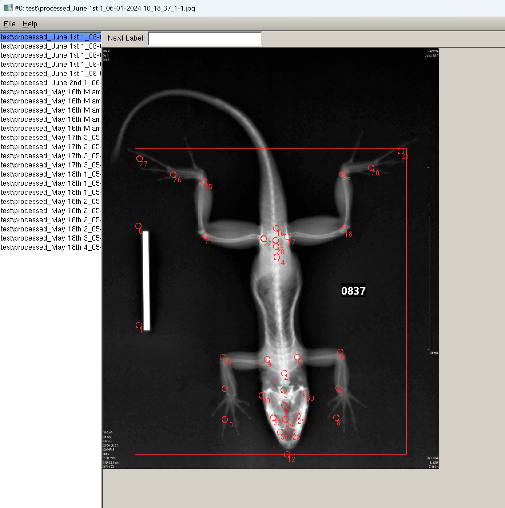

# Lizard-XRAYs
Automated processing and landmarking of lizard x-ray images

## Methods

The methods described below are still under development as of the time of this writing. I'll summarize the successes and failures up to this point and how to replicate these methods. All of my code can be found in the [Lizard X-Rays GitHub repo](https://github.com/Human-Augment-Analytics/Lizard-x-rays). The `ml-morph` package, heavily used for training models for automated landmarking, can be found [here](https://github.com/agporto/ml-morph). Before replicating any methods, please clone the Lizard X-rays repo and the `ml-morph` repo. Also, prepare a Python environment (I used a Conda environment) and install `numpy` with `pip install numpy==1.26.4`. Later versions of `numpy` did not work with `ml-morph`. Please note that I have a Windows machine, so any installation instructions that follow may differ if you are on Mac or another OS.

### Image Processing

For image processing, I focused on using techniques described in past research papers with a focus on image enhancement. Image enhancement involves improving the quality and appearance of an image. This process can correct flaws or defects, or simply make an image more visually appealing. Common goals include increasing contrast, sharpness, and colorfulness; reducing noise and blur; and correcting distortion and other defects. These techniques can be applied automatically using algorithms from OpenCV and PIL. In particular, I applied contrast adjustment, brightness and sharpness adjustment, histogram equalization, and gamma correction to the input images. Histogram Equalization (HE) aims to evenly distribute the gray levels in an image, giving each gray level an equal chance of occurring. This technique adjusts the brightness and contrast of dark and low-contrast images to enhance their quality. An improved variant of HE is Adaptive Histogram Equalization (AHE), which applies histogram equalization to small regions (patches) within the image. AHE enhances the contrast of each region individually, thereby improving local contrast and edges based on the local distribution of pixel intensities rather than global image information. Image normalization typically involves linear operations on individual pixels, such as scalar multiplication, addition, and subtraction. In contrast, gamma correction applies a non-linear operation to image pixels. This technique adjusts pixel values to enhance the image by using the relationship between the pixel value and the gamma value according to an internal mapping function.

Up to this point, I have developed two image processing scripts. The first one takes as input a folder of JPEG images and the other takes as input DCM images. The JPEG image processing script works well, improving the quality of the x-rays and getting them quite close to the images produced manually by the x-ray software used by the Stroud lab. This script, found [here](https://github.com/Human-Augment-Analytics/Lizard-x-rays/blob/main/x-ray_preprocessing.py), has command line arguments for various settings and levels of image enhancement. It also needs a path to a folder of JPEG files as input and an output folder to write the processed output files to.

The second script does not work as well at this time and is still under development. The quality of the enhanced DCM images is seemingly worse than the original files. This script can be found [here](https://github.com/Human-Augment-Analytics/Lizard-x-rays/blob/main/x-ray_preprocessing_dicom.py). Jon Suh has suggested further developing this script because DCM files contain much richer pixel information than JPEG files, hence why they are used by the medical imaging community. Thus, working with these DCM files directly is likely better suited for automated landmarking; however, further experimentation is necessary. For now, we are using the JPEG processing script to move ahead.

### Automated Landmarking

#### Annotating Data

The first step for automated landmarking is to actually produce annotations for the x-rays. This step was performed by Jon Suh and an undergraduate assistant in the Suh lab. They used tpsdig to annotate each x-ray image and produce .tps files. They provided me with a Dropbox folder containing the tps files, which can be found [here](https://www.dropbox.com/scl/fo/t77q0baokmb2zj2i2vs0a/AGJQ4FI9111QjSOxewEccao?rlkey=bt1hwxqqg9ue2k5iakcfasz7g&dl=0).

After obtaining tps files for each x-ray, I produced a combined tps file with all the data. This is a requirement for input into `ml-morph`. My script for performing this combination can be found [here](https://github.com/Human-Augment-Analytics/Lizard-x-rays/blob/main/combine_tps_files.py).

#### ml-morph

After obtaining a combined tps file, I cloned and prepared `ml-morph` to run locally on my computer. Be sure to downgrade `numpy` to 1.26.4 as described at the beginning of this section. Thereafter, I ran the preprocessing step for `ml-morph`, which generates `train.xml` and `test.xml` files and their corresponding train and test folders with images. The step I used is listed as [option 2 here](https://github.com/agporto/ml-morph?tab=readme-ov-file#option-2---previously-annotated-dataset). The `train.xml` and `test.xml` files generated with the current dataset can be found in the [GitHub](https://github.com/Human-Augment-Analytics/Lizard-x-rays/tree/main). 

Next, I trained the object detector model using the command [here](https://github.com/agporto/ml-morph?tab=readme-ov-file#2-training-and-testing-object-detectors-detector_trainerpy) with the modification of using a higher epsilon of 0.1 to speed up convergence. This model performs extremely well on the dataset because there aren't really any other objects to identify in the images besides the lizard itself. There is a ruler in some images, but this is never chosen by the model to be the lizard. Given more data, however, it may be necessary to tune the parameters of this model further.

Thereafter, I trained the shape predictor model to place landmarks on new images. I used the command detailed in Section 3 of the ml-morph README [here](https://github.com/agporto/ml-morph?tab=readme-ov-file#3-training-and-testing-shape-predictors-shape_trainerpy). The performance of the current shape predictor model can be improved, and I am currently conducting hyperparameter tuning. Adding additional landmarked data will also affect this process. In particular, I believe I will need to tune the cascade and tree depth parameters in order to avoid overfitting to the training data.

Finally, I ran the predictions script described in [Section 4](https://github.com/agporto/ml-morph?tab=readme-ov-file#4-predicting-the-landmark-positions-in-a-new-set-of-images-predictionpy) of the ml-morph README. This generates an output XML file which can be visualized by imglab as described in the next subsection.

#### imglab and CMAKE

In order to visualize the output XML file of predictions generated by ml-morph, I needed to download and install imglab. First, clone the dlib repo found [here](https://github.com/davisking/dlib/tree/master/tools/imglab). Next, update the `CMakeLists.txt` file in the `tools/imglab` directory to match the one in the repo [here](https://github.com/Human-Augment-Analytics/Lizard-x-rays/blob/main/CMakeLists.txt). Note that if you do not have Giflib, download it from [here](https://sourceforge.net/projects/gnuwin32/files/giflib/4.1.4-1/giflib-4.1.4-1-src.exe/download?use_mirror=master&download=) and install. After that, compile imglab as per the [instructions](https://github.com/davisking/dlib/tree/master/tools/imglab) to produce the `imglab.exe` file. While running the executable, you may run into an error where you also need the `giflib4.dll` to be copied to the same directory you are running the imglab executable from. In that case, copy this dll from the Giflib directory in Program Files to the same directory as the `imglab.exe` file. Finally, run `imglab.exe` with the output XML file produced by the predictions script and the folder with the x-ray images as per the instructions [here](https://github.com/davisking/dlib/tree/master/tools/imglab). You should see an awesome overlay screen like in the image below where you can cycle through different images in the test set.

